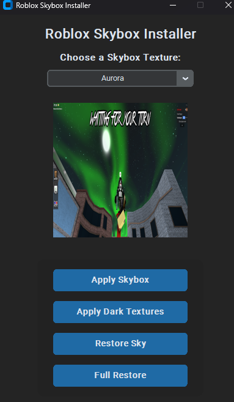

# Auto Install Skybox and Dark Textures

Auto Installs A Custom Skybox and Dark Textures if you want them ment for roblox rivals but works on all games
[Video](https://www.youtube.com/watch?v=A2RKEF0zFRc)

## Installation (new)
1. Clone The Repo
2. Extract the .zip file
3. Open `New-GUI`
4. Run `Install-and-Run.bat` as admin 

## Installation (old)
1. Clone The Repo
2. Extract the .zip file
3. Open `Old-CLI`
4. Run `install.bat` as admin

### Preview

