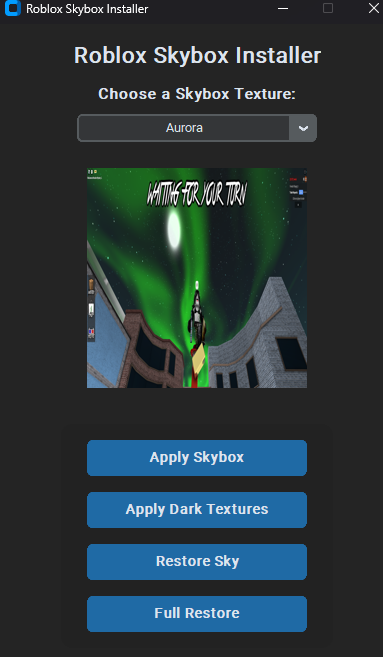

# Auto Install Skybox and Dark Textures

Auto Installs A Custom Skybox and Dark Textures if you want them ment for roblox rivals but works on all games

## Installation (new)
1. Clone The Repo
2. Open `New GUI`
3. Run `Install-and-Run.bat` as admin 

## Installation (old)
1. Clone The Repo
2. Open `Old CLI`
3. Run `install.bat` as admin

### Preview

